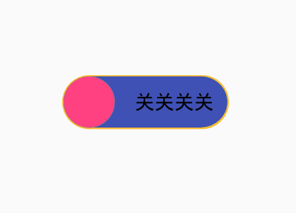

### SHOW


### WHEN

When state changed.

### WHY

See ios `switch` :smile:

### HOW

```xml
    <com.goav.toggle.ToggleButton
        android:id="@+id/togglebutton"
        android:layout_width="120dp"
        android:layout_height="40dp"
        android:layout_centerInParent="true"
        app:toggle_border_color="@android:color/holo_orange_light"
        app:toggle_border_width="1dp"
        app:toggle_close_color="?attr/colorPrimary"
        app:toggle_close_text="关关关关"
        app:toggle_color="?attr/colorAccent"
        app:toggle_open_text="开开开开" />
```


